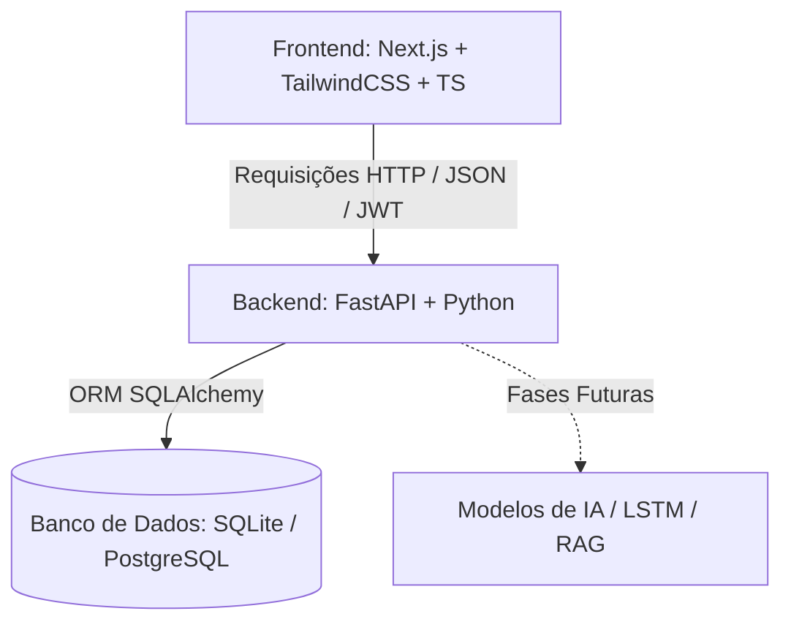
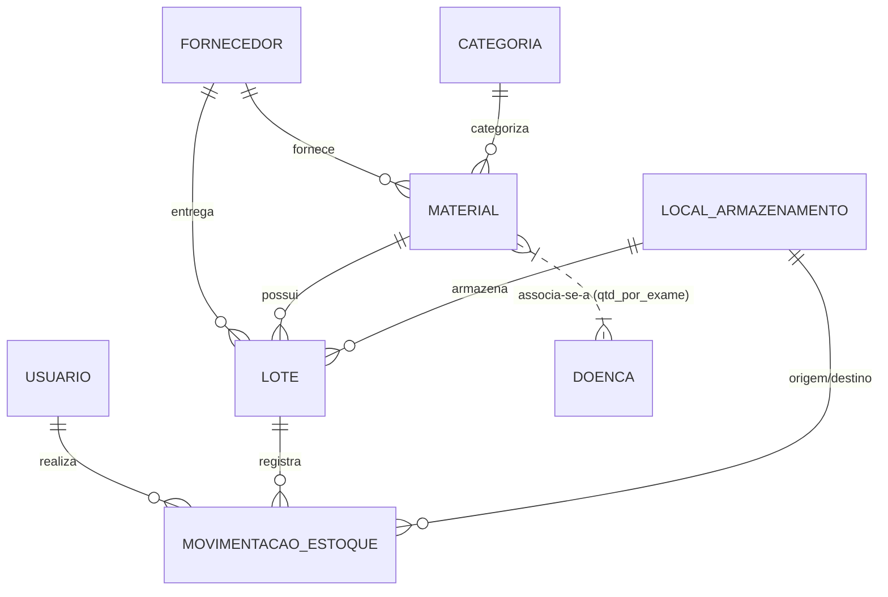

# StockIA — Gestão Inteligente de Insumos Laboratoriais

O **StockIA** é um sistema completo de gestão de estoque laboratorial projetado para integrar a administração diária de insumos de diagnóstico e pesquisa médica com recursos de **Inteligência Artificial (IA)** para previsão de demanda baseada em picos epidemiológicos e doenças sazonais.

---

## 1. Contexto e Origem Científica

O projeto é diretamente fundamentado no estudo científico apresentado no **COBRIC 2025** (*Congresso de Iniciação Científica da Universidade Santa Cecília - Unisanta*), intitulado:

> **"O USO DA INTELIGÊNCIA ARTIFICIAL NA GESTÃO DE INSUMOS LABORATORIAIS E PREVISIBILIDADE DE DOENÇAS EM PERÍODOS SAZONAIS"**
> * Curso: Biomedicina.

### O Problema Identificado
As doenças sazonais — como a **Influenza** (gripe comum no outono/inverno), **Dengue, Chikungunya e Zika** (picos em períodos chuvosos e quentes) e o **Vírus Sincicial Respiratório (RSV)** (afetando crianças nos meses frios) — causam impactos epidemiológicos e econômicos bilionários no **Sistema Único de Saúde (SUS)**. 

Esses surtos geram uma **demanda intermitente e abrupta por insumos laboratoriais específicos** (kits de extração, reagentes, testes rápidos de antígeno e PCR). Sem previsão, os laboratórios públicos enfrentam dois grandes gargalos:
1. **Desabastecimento**: Falta de insumos diagnósticos durante o pico epidêmico, impedindo o tratamento precoce.
2. **Desperdício (Superfaturamento/Vencimento)**: Compra emergencial excessiva de insumos que acabam vencendo no estoque devido à falta de controle de validade e fim do ciclo sazonal.

### A Solução Proposta
O estudo dos pesquisadores revelou uma **lacuna na literatura nacional**: embora existam modelos de IA eficientes para previsão de surtos (como redes neurais recorrentes **LSTM**), eles **não se integram aos sistemas operacionais de gestão de estoque**. 

O **StockIA** nasceu para preencher essa lacuna, integrando uma ferramenta robusta de gestão de inventário laboratorial a um módulo de inteligência de demanda.

---

## 2. Para que Serve o Sistema?

O StockIA tem como principais objetivos:
* **Garantir o Abastecimento Inteligente**: Prever picos de demanda de exames diagnósticos com antecedência de 4 a 12 semanas (usando dados epidemiológicos e climáticos), sugerindo compras automáticas de insumos associados a determinadas doenças.
* **Controlar Validade e Perdas (Metodologia FEFO)**: Gerenciar os lotes de reagentes priorizando a saída do que vence primeiro (*First Expired, First Out*).
* **Rastreabilidade e Compliance**: Registrar de forma imutável todas as entradas, saídas, descartes e ajustes de estoque para auditorias regulatórias (**RDC nº 302/2005** e **nº 330/2019 da ANVISA**, ISO e Boas Práticas de Laboratório - GLP).
* **Prevenir Riscos e Controlar Condições**: Monitorar faixas de temperatura de armazenamento (cadeia de frio) e classes de risco dos materiais (biológico, químico, inflamável).

---

## 3. Como Funciona a Arquitetura do Sistema?

O sistema é construído sobre uma arquitetura moderna dividida em duas camadas principais (**Full-Stack**):



### 3.1. O Backend (`/Backend`)
Desenvolvido em **Python 3**, utilizando um ecossistema focado em alto desempenho e segurança:
* **FastAPI**: Framework assíncrono moderno e de alto desempenho para expor as rotas RESTful. Gera a documentação automática do sistema via Swagger UI (`/docs`).
* **Uvicorn**: Servidor ASGI que atua como o motor de execução da API local.
* **SQLAlchemy**: ORM (*Object-Relational Mapping*) para gerenciar a persistência de dados em nível de código Python de forma independente do SGBD.
* **Alembic**: Ferramenta de versionamento e migrações do banco de dados, permitindo evolução segura do esquema.
* **Bancos de Dados Suportados**: SQLite (`stockai.db` para desenvolvimento rápido e testes locais) ou PostgreSQL (gerenciado via contêineres Docker para produção).

### 3.2. O Frontend (`/frontend`)
Uma aplicação rica e interativa desenvolvida em **React** e **Next.js** (App Router) com **TypeScript**:
* **Painel Administrativo Completo**: Interface intuitiva e com estética premium baseada em *Glassmorphism* (efeitos de transparência fosca e gradientes modernos).
* **Controle de Sessão**: Autenticação de usuários baseada em tokens **JWT** (*JSON Web Tokens*) com persistência de estado.
* **Módulos Principais do Dashboard**:
  * **Inventário de Materiais**: Catálogo completo dos insumos e reagentes.
  * **Controle de Lotes**: Visualização de quantidades físicas e datas de validade por lote.
  * **Auditoria (Movimentações)**: Rastreabilidade total de quem movimentou o quê, quando e o motivo.
  * **Fornecedores**: Gestão de dados dos fornecedores e fabricantes.

---

## 4. O Modelo de Dados (As Entidades)

O banco de dados do **StockIA** é estruturado em **8 tabelas principais** + 1 associativa, projetadas para responder a todas as regras de controle de qualidade laboratorial e alimentar a camada de IA preditiva:



1. **Usuário (`Usuario`)**: Representa os profissionais que operam o sistema. Possui perfis de acesso restritos:
   * `ADMIN`: Controle total de configurações e usuários.
   * `GESTOR`: Focado em relatórios, estoque geral e compras.
   * `PESQUISADOR` / `TECNICO`: Realiza movimentações de uso do dia a dia.
2. **Fornecedor (`Fornecedor`)**: Cadastro de fornecedores com CNPJ (armazenado sem máscara — só dígitos), contato e e-mail.
3. **Categoria (`Categoria`)**: Classificação dos materiais (ex: Reagentes de PCR, Vidrarias, Placas de Petri, Meios de Cultura).
4. **Local de Armazenamento (`LocalArmazenamento`)**: Onde o estoque físico fica guardado. Suporta múltiplos depósitos/geladeiras/freezers:
   * `tipo`: `REFRIGERADO`, `CONGELADO`, `AMBIENTE`, `INFLAMAVEIS`.
   * Leitura opcional de **temperatura atual** (integração futura com sensores IoT).
5. **Material (`Material`)**: O catálogo de produtos do laboratório. Armazena especificações críticas:
   * Fabricante e código no catálogo.
   * **Classe de risco**: (Ex: Biológico, Químico, Inflamável).
   * **Controle de Cadeia de Frio**: Campo booleano `exige_refrigeracao` e limites exatos de temperatura mínima e máxima de armazenamento.
   * **Unidade de medida canônica** (`unidade_medida` e `fator_conversao`): toda movimentação é registrada na unidade base do material (ex: "ml"), evitando confusão entre "caixa" e "unidade".
   * **`estoque_minimo`**: gatilho automático de alerta de ressuprimento. Núcleo do controle preventivo *antes* da IA entrar em cena.
   * **`estoque_maximo`** (opcional): teto para evitar compras emergenciais excessivas que acabam virando descarte por vencimento.
6. **Lote (`Lote`)**: O estoque físico real. Um material pode ter vários lotes ativos em locais diferentes. Controla:
   * Data de fabricação e **data de validade** (crítico para a metodologia FEFO).
   * Quantidade física atual (atualizada via *trigger* a cada movimentação, garantindo consistência atômica).
   * `local_id`: em qual depósito/geladeira o lote físico está hoje.
   * Arquivo ou link do *Certificado de Análise* do lote.
7. **Movimentação de Estoque (`MovimentacaoEstoque`)**: A trilha de auditoria digital. Toda alteração de estoque gera um registro **imutável** indicando:
   * O lote afetado e o usuário responsável.
   * **Tipo de Movimentação**:
     * `ENTRADA` (compra/recebimento)
     * `USO` (consumo na rotina de exames)
     * `DESCARTE` (por vencimento ou avaria)
     * `AJUSTE` (correção manual após inventário)
     * `TRANSFERENCIA` (movimentação entre `local_origem_id` e `local_destino_id`)
   * `estorno_de_id`: referência opcional para outra movimentação que está sendo anulada — preserva o histórico para auditoria ANVISA (nunca deletamos um lançamento errado, criamos um estorno).
   * `quantidade > 0` é garantida por *check constraint*; o sinal (soma ou subtrai) vem do `tipo`.
8. **Doença (`Doenca`)**: Catálogo de patologias epidemiológicas que vão alimentar a previsão sazonal:
   * `cid_codigo`: código CID-10 (ex: `A90` para Dengue).
   * `sazonalidade`: classificação (`VERAO_CHUVOSO`, `INVERNO`, `ANO_TODO`).
   * `meses_pico`: meses históricos de surto (ex: `"1,2,3"` para jan-mar) — entra direto como sazonalidade customizada no Prophet.
   * `regiao_endemica`: recorte geográfico (`SUDESTE`, `NORDESTE`, etc).
9. **Associação Material ↔ Doença (`materiais_doencas`)**: relação N:N enriquecida com `quantidade_media_por_exame` — é o multiplicador que converte "previsão de N casos de dengue" em "previsão de N × qtd_por_exame ml de reagente necessário".

> **Nota de design — saldo de lote:** o campo `lotes.quantidade_atual` é desnormalizado (cache do saldo). A consistência é garantida por *trigger* PostgreSQL que recalcula o saldo a cada `INSERT` em `movimentacoes_estoque`. Em ambiente SQLite (dev), a mesma lógica é aplicada na camada de serviço dentro de transação. Isso torna a consulta FEFO ("qual lote desse material vence primeiro e ainda tem saldo?") instantânea sem precisar agregar todo o histórico.

---

## 5. Como Executar o Projeto Localmente

### 5.1. Rodando o Backend (FastAPI)

1. Entre na pasta `/Backend`:
   ```bash
   cd Backend
   ```
2. Crie e ative um ambiente virtual do Python:
   ```bash
   python -m venv .venv
   # No Windows:
   .venv\Scripts\activate
   ```
3. Instale as dependências listadas no arquivo `info.txt`:
   ```bash
   pip install fastapi uvicorn sqlalchemy alembic psycopg2-binary python-dotenv
   ```
4. Se necessário, inicialize o banco de dados SQLite executando o script de criação:
   ```bash
   python criar_banco.py
   python seed_categorias.py
   ```
5. Inicie o servidor FastAPI:
   ```bash
   uvicorn app.main:app --reload
   ```
6. O backend estará acessível em: [http://localhost:8000](http://localhost:8000). Você pode acessar a documentação interativa em [http://localhost:8000/docs](http://localhost:8000/docs).

### 5.2. Rodando o Frontend (Next.js)

1. Entre na pasta `/frontend`:
   ```bash
   cd frontend
   ```
2. Instale as dependências:
   ```bash
   npm install
   ```
3. Inicie o servidor de desenvolvimento:
   ```bash
   npm run dev
   ```
4. Abra o **Firefox** (conforme regras globais do usuário) e acesse: [http://localhost:3000](http://localhost:3000).

---

## 6. Planejamento Futuro (Módulo de IA)

O ecossistema inteligente de previsão está planejado para a **Fase 3** do projeto. A arquitetura é dividida em duas camadas que trabalham em equipe: uma **IA preditiva** (matemática, opera no escuro) e uma **IA generativa** (LLM, traduz a previsão em recomendação acionável no dashboard).

### 6.1. Camada Preditiva — Prophet como motor principal

O motor de previsão de demanda na Fase 3.1 será o **Prophet** (biblioteca open-source da Meta), escolhido após avaliação comparativa com Redes Neurais LSTM. Os critérios decisórios:

| Critério | Prophet | LSTM |
|---|---|---|
| **Volume mínimo de dados** | 6-12 meses | 24+ meses |
| **Sazonalidade epidemiológica** | Nativa (`meses_pico` da doença vira regressor) | Aprende, mas precisa de muito histórico |
| **Explicabilidade (ANVISA/SUS)** | Alta — mostra a curva de cada componente | Baixa — black-box |
| **Custo computacional** | Roda no backend, sem GPU | Treino caro, requer tuning |
| **Robustez a buracos no histórico** | Alta | Sensível |

Como o StockIA é um sistema novo e o histórico de movimentações `USO` ainda está sendo construído, **começar pelo Prophet é a decisão correta**. LSTM fica como linha de pesquisa para a Fase 3.3, quando houver dados suficientes para um benchmark justo.

**Roadmap de evolução da camada preditiva:**

| Subfase | Pré-requisito | Modelo | Inputs |
|---|---|---|---|
| **3.1** | ≥6 meses de movimentações `USO` | Prophet univariado | Histórico de uso por material |
| **3.2** | ≥12 meses + acesso a APIs externas | Prophet + `add_regressor` | + dados [InfoDengue](https://info.dengue.mat.br/), boletins do SINAN, clima (INMET/CPTEC) |
| **3.3** | ≥24 meses | LSTM (benchmark vs Prophet) | Substitui Prophet **apenas se** ganho de precisão > 15% |

Como o Prophet roda numa rotina noturna (madrugada), ele varre o banco e identifica padrões do tipo: *"O Lote X vai zerar em 15 de abril, mas o pico histórico da doença Y na região começa em 10 de abril"*. Esse alerta numérico é então passado para a camada generativa.

### 6.2. Camada Generativa — LLM como tradutor humano

Em cima do alerta matemático do Prophet, um modelo generativo (**Gemini** ou **GPT-4**) gera a recomendação em linguagem natural exibida no dashboard:

> ⚠️ **Alerta Crítico** — Historicamente, a região apresenta um surto de Dengue nesta época do ano. Seu estoque atual do reagente *Kit NS1* suporta apenas **12 dias**. Sugerimos acionar o fornecedor *Bioclin* imediatamente.

A separação Prophet (decisão matemática) + LLM (tradução para humano) é uma escolha consciente: a IA generativa **nunca decide o que prever** — ela só explica o que a IA preditiva já calculou. Isso mantém a auditabilidade exigida pelo ambiente regulado.

### 6.3. Leitor Inteligente de FISPQ via RAG

Componente independente, planejado para a mesma fase: permitir o upload da Ficha de Informações de Segurança de Produtos Químicos (FISPQ) de um novo reagente e fazer perguntas livres em linguagem natural sobre manipulação segura, riscos de toxicidade e procedimentos de descarte. Implementação via **RAG** (*Retrieval-Augmented Generation*) — vetoriza o documento, indexa, e responde com fundamento direto no texto da própria FISPQ (sem alucinação).
